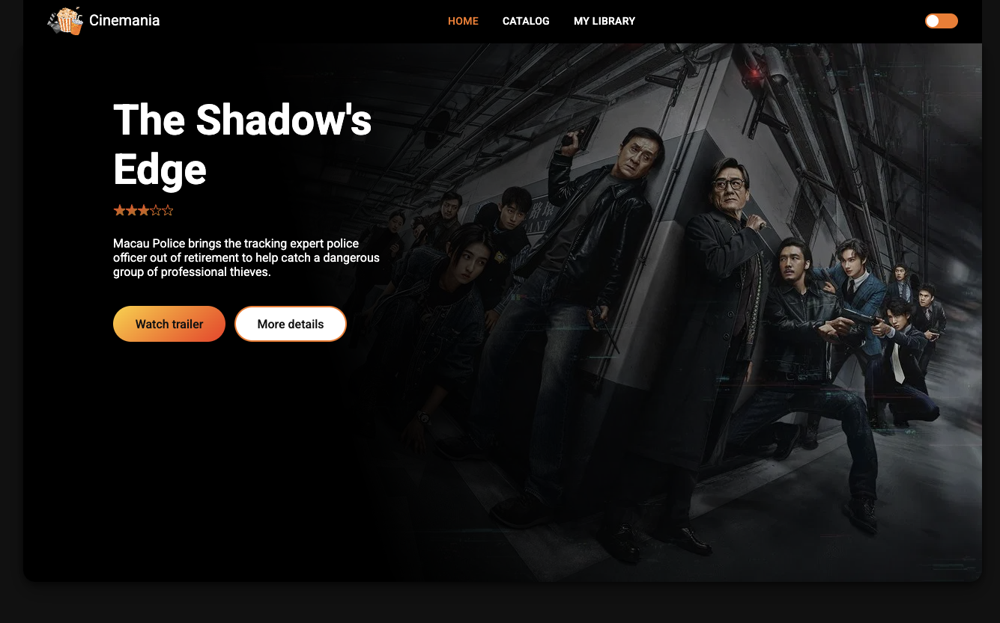
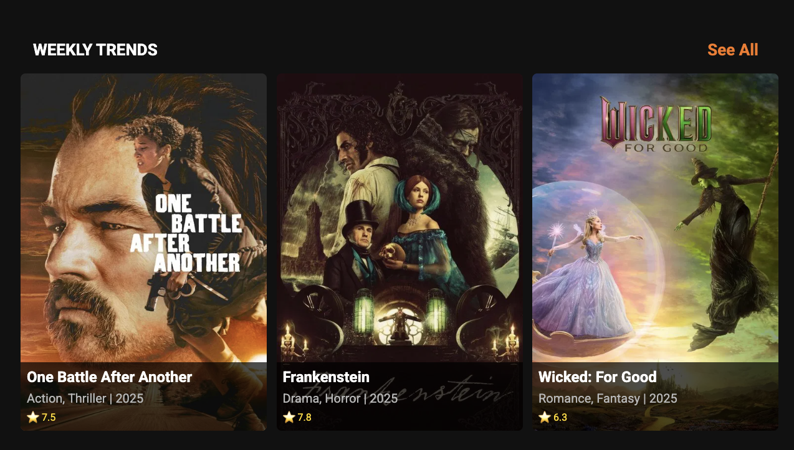
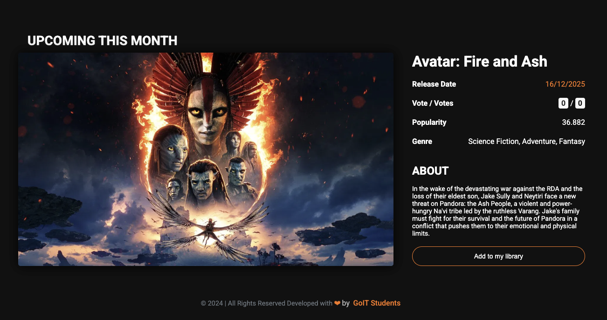

<div align="center">
	<!-- Showcase Screenshots (replace src & alt) -->
	
	
	

# 🎬 Cinemania

Modern, high‑performance movie discovery & personal library web app powered by
TMDB.

</div>

## 🚀 Overview

Cinemania is a multi‑page, Vite‑bundled vanilla JS project showcasing clean
front‑end architecture without a heavy framework. It consumes TMDB endpoints
(trending, upcoming, search, genres) and lets users build a local “My Library”
with add/remove interactions and persistent state. Designed as a
portfolio/reference piece: fast load, modular code, clear improvement roadmap.

## ✨ Core Features

- Dynamic Hero & Random Upcoming spotlight
- Weekly trending section (extensible module)
- Search & catalog listing (paginated)
- Local Library (genre filter, empty state UX)
- Detail & Team modals (lazy-loaded content)
- Dark/Light theme persistence
- Scroll-to-top utility & responsive layout

## 🛠 Tech Stack

- Build: Vite + HTML partial injection + optimized chunks
- Language: ES Modules, semantic HTML5, modular CSS
- API: TMDB (Axios abstraction layer)
- State: LocalStorage (`myLibrary`)
- Tooling: PostCSS media query sort, full reload plugin
- Assets: Responsive images (future srcset enhancement)

## 🧱 Architecture Snapshot

```
src/
	index.html / catalog.html / mylibrary.html
	partials/        # Injected HTML fragments
	js/              # Feature controllers & API layer
	css/             # Component + token styles (root.css)
```

Principles: small focused modules, explicit data flow, no hidden globals, easy
refactor path (e.g. extract library store).

## 🔑 Value Proposition (Interview Pitch)

Demonstrates: API integration, modular vanilla JS design, performance awareness,
state management, accessibility considerations, and production‑ready build
pipeline without relying on a framework. Clear roadmap signals senior
engineering thinking.

## 🧪 Potential Enhancements

- Centralized library store module (reduce duplication)
- Env‑based API key (`VITE_TMDB_API_KEY`)
- Modal accessibility (focus trap + ESC)
- Image `srcset` + lazy loading
- Jest + Lighthouse CI

## ⚡ Quick Start

```bash
git clone https://github.com/your-user/Cinemania.git
cd Cinemania
npm install
echo "VITE_TMDB_API_KEY=YOUR_KEY" > .env
npm run dev
```

Visit the dev URL printed by Vite.

## 🗺 Roadmap (Short)

1. Library store refactor
2. Accessible modals
3. Debounced autosuggest search
4. i18n (en/tr)
5. Testing & CI

## 📄 License

Add preferred license (MIT recommended) before public distribution.
